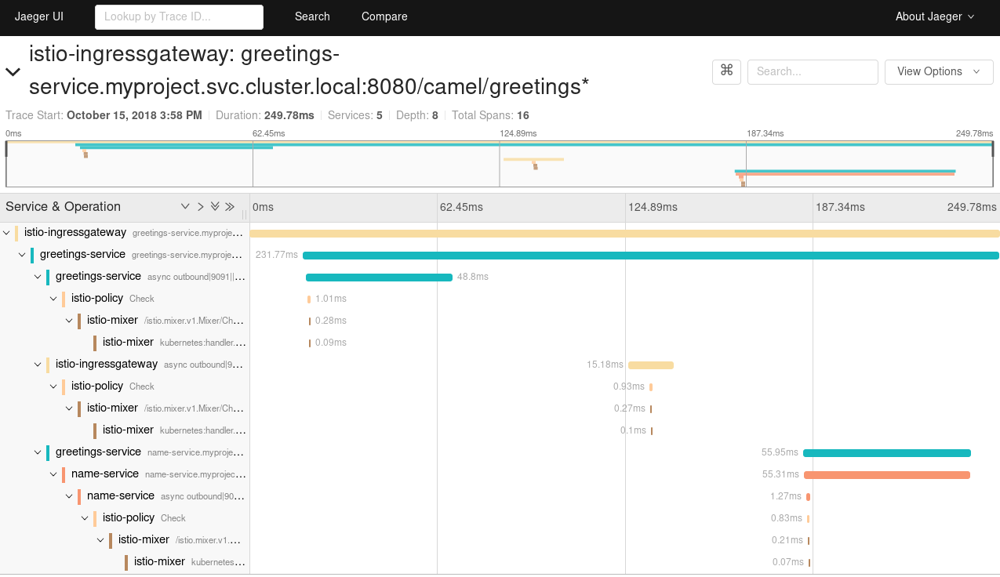

:launchURL: https://developers.redhat.com/launch
:repoName: fuse-istio-distributed-tracing-booster
:image: registry.access.redhat.com/fuse7/fuse-java-openshift:1.0

= Istio Distributed Tracing - Fuse Booster

== Overview

The Fuse Istio Distributed Tracing booster demonstrates Istio’s Distributed Tracing via a (minimally) instrumented set of Apache Camel/Spring Boot applications:

* A _name service_ that returns a name to greet.
* A _greeting service_ that invokes the name service to get a name and then returns the `Hello, NAME` string.

When you run this booster, it injects Istio envoy proxy sidecars containers and both applications become part of a "service mesh". Istio automatically gathers tracing information by following the flow of a request across the services.

== Deployment options

You can run this booster in the following modes:

* Single-node OpenShift cluster
* OpenShift Online at link:{launchURL}[]

=== Prerequisites

* Java 8 JDK (or later)
* Maven 3.3.x (or later)
* OpenShift 3.10 (or later) / Kubernetes 1.10 (or later) cluster
* Istio 1.0.x installed on the cluster
+
If Istio is not installed and you have admin privileges, you can install it using the link:https://github.com/Maistra/istio-operator[Istio Operator] by following  link:https://github.com/Maistra/openshift-ansible/blob/maistra-0.1.0-ocp-3.1.0-istio-1.0.0/istio/Installation.md[these instructions].
* rewriteAppHTTPProbe: true or mTSL disabled as explained in link:https://istio.io/help/ops/setup/app-health-check/#probe-rewrite[Istio app health check probe rewritel]

As part of the process of creating this booster, link:{launchURL}[] sets up a project with a CI/CD deployment of this booster. You can see the status of this deployment in your single-node OpenShift cluster or OpenShift Online web console.

== Running the booster on a single-node OpenShift cluster
A single-node OpenShift cluster provides you with access to a cloud environment that is similar to a production environment.

If you have a single-node OpenShift cluster, such as Minishift or the Red Hat Container Development Kit, link:http://appdev.openshift.io/docs/minishift-installation.html[installed and running], you can deploy your booster there.

For more details about running this booster on a single-node OpenShift cluster, CI/CD deployments, as well as the rest of the runtime, see the link:http://appdev.openshift.io/docs/spring-boot-runtime.html[Spring Boot Runtime Guide].

To deploy this booster to a running single-node OpenShift cluster:

. Download the booster project and extract the archive on your local file system.

. Log in to your OpenShift cluster:
+
[source,bash,options="nowrap",subs="attributes+"]
----
$ oc login -u system:admin
----

. Create a new OpenShift project for the booster:
+
[source,bash,options="nowrap",subs="attributes+"]
----
$ oc new-project MY_PROJECT_NAME
----

. Change the directory to the folder that contains the extracted booster application (for example, `my_openshift/{repoName}`) :
+
[source,bash,options="nowrap",subs="attributes+"]
----
$ cd my_openshift/fuse-istio-distributed-tracing-booster
----

. Build and deploy the project to the OpenShift cluster:
+
[source,bash,options="nowrap",subs="attributes+"]
----
$ mvn clean -DskipTests fabric8:deploy -Popenshift
----

. If your environment does not support automatic sidecar injection, you must manually inject the Istio sidecar envoy proxy:
+
[source,bash,options="nowrap",subs="attributes+"]
----
$ oc get dc name-service -o yaml | <istio_install_directory>/bin/istioctl kube-inject -f - | oc apply -f -
$ oc get dc greetings-service -o yaml | <istio_install_directory>/bin/istioctl kube-inject -f - | oc apply -f -
----

. Create a RouteRule to forward traffic from `istio-ingress` to the booster application:
+
[source,bash,options="nowrap",subs="attributes+"]
----
$ oc create -f istio/greetings-gateway.yaml
----
IMPORTANT: for how the istio gateway used in this example is configured this must be the only resource on the cluster of type `gateway.networking.istio.io`.

. Access the application through `istio-ingress`:

.. Run the following command to retrieve the appropriate URL to access the booster application:
+
*Note:* Make sure you that you specify the URL with the HTTP scheme. HTTPS is *not* enabled by default.
+
[source,bash,options="nowrap",subs="attributes+"]
----
$ echo http://$(oc get route istio-ingressgateway -o jsonpath='{.spec.host}{"\n"}' -n istio-system)/camel/greetings/
----
+
The command returns the istio-system istio-ingress URL, appended with the RouteRule path.

.. Open the returned URL in a web browser. You should see the json output of the Greetings REST service.

.. Now you can access the Jaeger tracing dashboard and found data of the just completed REST invocation.
+
After a few seconds, after all the spans have been collected, the traces from the invocation of the REST endpoint should look similar to the following example:
+

[#single-node-without-preinstalled-images]
=== Running the booster on a single-node OpenShift cluster without preinstalled images

To deploy your booster to a running single-node OpenShift cluster without preinstalled images:

. Download the project and extract the archive on your local filesystem.

. Log in to your OpenShift cluster:
+
[source,bash,options="nowrap",subs="attributes+"]
----
$ oc login -u system:admin
----

. Create a new OpenShift project for the booster:
+
[source,bash,options="nowrap",subs="attributes+"]
----
$ oc new-project MY_PROJECT_NAME
----

. Import base images to your newly created project (MY_PROJECT_NAME):
+
[source,bash,options="nowrap",subs="attributes+"]
----
$ oc import-image fis-java-openshift:2.0 --from={image} --confirm
----

. Change the directory to the folder that contains the extracted booster application (for example, `my_openshift/{repoName}`) :
+
[source,bash,options="nowrap",subs="attributes+"]
----
$ cd my_openshift/fuse-istio-distributed-tracing-booster
----

. Build and deploy the project to the OpenShift cluster:
+
[source,bash,options="nowrap",subs="attributes+"]
----
$ mvn clean -DskipTests fabric8:deploy -Popenshift -Dfabric8.generator.fromMode=istag -Dfabric8.generator.from=MY_PROJECT_NAME/fis-java-openshift:2.0
----

. If your environment dose not support automatic sidecar injection, you need to manually inject istio sidecar envoy proxy:
+
[source,bash,options="nowrap",subs="attributes+"]
----
$ oc get dc name-service -o yaml | <istio_install_directory>/bin/istioctl kube-inject -f - | oc apply -f -
$ oc get dc greetings-service -o yaml | <istio_install_directory>/bin/istioctl kube-inject -f - | oc apply -f -
----

. Create a RouteRule to forward traffic from istio-ingress to the booster application:
+
[source,bash,options="nowrap",subs="attributes+"]
----
$ oc create -f istio/greetings-gateway.yaml
----

. Access the application through istio-ingress:
+
Run the following command to determine the appropriate URL to access the booster application.
+
*Note:* Make sure you that you specify the URL with the HTTP scheme. HTTPS is *not* enabled by default.
+
[source,bash,options="nowrap",subs="attributes+"]
----
$ echo http://$(oc get route istio-ingressgateway -o jsonpath='{.spec.host}{"\n"}' -n istio-system)/camel/greetings/
----
+
The result of the above command is the istio-system istio-ingress URL, appended with the RouteRule path. Open this URL in a web browser.

. Access the Jaeger tracing dashboard.
+
After a few seconds, after all the spans have been collected, the traces from the invocation of the REST endpoint should look similar to the following example:
+

== Running the booster on OpenShift Online

To deploy the Fuse Istio distributed tracing booster directly to OpenShift Online:

. Go to link:{launchURL}[] and login.
. Click *Launch Your Project*.
. Follow the on-screen instructions to create an application. Select *Code Locally, Build and Deploy*, *Istio - Distributed Tracing* mission, and the *Fuse* runtime.
